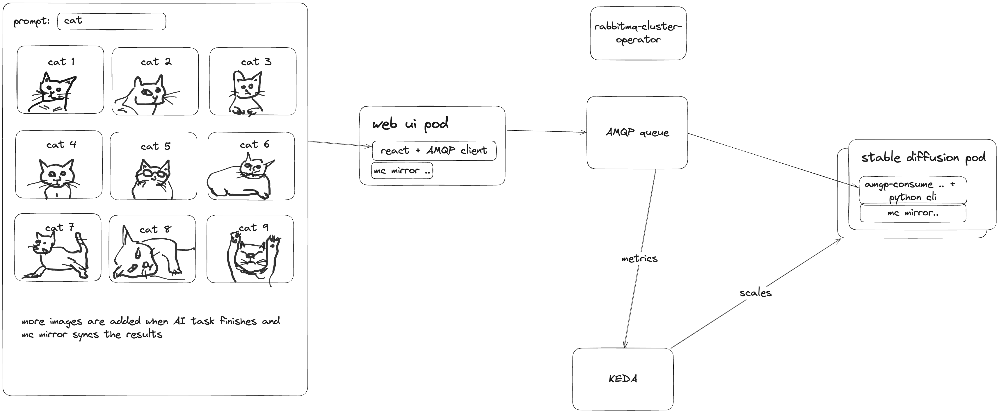

## Stable Diffusion use-case


https://excalidraw.com/#json=p1f9nzyFye_sOgnV9AmIL,69oUi00h3HKXnsyzUReA5g

### Try the container image locally

```
make build-image
PROMPT="cartoon dwarf" NUM_IMAGES=7 make run-example
```

### Try the local k8s setup

This requires `k3d` binary to be present on the `$PATH` and also the GPU support is turned off.

```
GPU="" make deploy-from-scratch
```

### Deploy to K8s

```
make deploy
```

This deploys Minio, RabbitMQ and web ui that can send request for image generation to the job queue.

From now you can continue either with a `scaledobject` approach or with `scaledjob` approach.

#### Deploy scaledjob or scaledobject

```
make deploy-scaledjob
```

XOR

```
make deploy-scaledobject
```

When using the `scaledjob` approach, the new kubernetes jobs are being created if the message queue is not empty and each job can process exactly one request from
the job queue. Once it generates the image, its side-car container with minio will sync the result (image and metadata file) to a shared filesystem and pod with job is terminated.

On the other hand, with scaledobject approach, normal Kubernetes deployment is being used for worker pods and these run the infinite loop where they process one job request
after another. The deployment is still subject of KEDA autoscaling so if there are no more pending messages in the job queue, the deployment is scaled to min replicas (`0`).


## Common Pain Points

### Container images are too large

Reasons:
- the models are too large (~4 gigs)
- python

Mitigation:
- pre-fetch or even bake the container images on a newly spawned k8s nodes

### GPUs being too expensive
- https://cloud.google.com/spot-vms/pricing#gpu_pricing

Mitigation:
- use node pool that can scale the number of GPU enabled nodes to zero replicas. This on the other hand ends up with significant delay if there are no GPU enabled k8s nodes and user
is waiting for their creation (installation of nvidia drivers).


### Example GKE Setup

#### two-nodes conventional k8s cluster with a GPU based elastic node pool

```
gcloud -q beta container clusters delete use-cases --zone us-east4-a --project "kedify-initial" --async
gcloud beta container --project "kedify-initial" clusters create "use-cases" \
   --no-enable-basic-auth \
   --cluster-version "1.28.8-gke.1095000" \
   --release-channel "regular" \
   --machine-type "e2-medium" \
   --image-type "COS_CONTAINERD" \
   --disk-type "pd-balanced" \
   --disk-size "100" \
   --metadata disable-legacy-endpoints=true \
   --spot \
   --num-nodes "2" \
   --logging=SYSTEM,WORKLOAD \
   --monitoring=SYSTEM \
   --enable-ip-alias \
   --network "projects/kedify-initial/global/networks/default" \
   --subnetwork "projects/kedify-initial/regions/us-east4/subnetworks/default" \
   --no-enable-intra-node-visibility \
   --default-max-pods-per-node "110" \
   --security-posture=disabled \
   --workload-vulnerability-scanning=disabled \
   --no-enable-master-authorized-networks \
   --addons HttpLoadBalancing,GcePersistentDiskCsiDriver \
   --enable-autoupgrade \
   --enable-autorepair \
   --max-surge-upgrade 1 \
   --max-unavailable-upgrade 0 \
   --binauthz-evaluation-mode=DISABLED \
   --no-enable-managed-prometheus \
   --node-locations "us-east4-a"

  # https://cloud.google.com/kubernetes-engine/docs/how-to/gpus#create-gpu-pool-auto-drivers
  gcloud beta container \
    --project "kedify-initial" node-pools create "gpu-pool" \
    --cluster "use-cases" \
    --machine-type "n1-standard-4" \
    --accelerator "type=nvidia-l4,count=1" \
    --image-type "UBUNTU_CONTAINERD" \
    --disk-type "pd-balanced" \
    --disk-size "150" \
    --metadata disable-legacy-endpoints=true \
    --node-taints nvidia.com/gpu=present:NoSchedule \
    --service-account "kedify-initial@kedify-initial.iam.gserviceaccount.com" \
    --spot \
    --num-nodes "1" \
    --enable-autoscaling \
    --total-min-nodes "1" \
    --total-max-nodes "2" \
    --scale-down-unneeded-time=1800s \
    --scan-interval=10s \
    --location-policy "ANY" \
    --max-surge-upgrade 0 \
    --max-unavailable-upgrade 1 \
    --max-pods-per-node "110" \
    --tags=nvidia-ingress-all \
    --node-locations "us-east4-a"

  gcloud container clusters update use-cases \
    --project "kedify-initial" \
    --zone us-east4-a \
    --enable-autoprovisioning \
    --min-cpu=1 --max-cpu=6 --min-memory=1 --max-memory=16 \
    --autoprovisioning-scopes=https://www.googleapis.com/auth/logging.write,https://www.googleapis.com/auth/monitoring,https://www.googleapis.com/auth/devstorage.read_only,https://www.googleapis.com/auth/compute

# login
gcloud container clusters get-credentials use-cases --zone us-east4-a --project kedify-initial
```

#### 1-node cluster with GPU enabled node

```
gcloud -q beta container clusters delete use-cases-single-node --zone us-east4-a --project "kedify-initial" --async
gcloud beta container clusters create use-cases-single-node \
  --project "kedify-initial" \
  --zone us-east4-a \
  --release-channel "regular" \
  --machine-type "n1-standard-4" \
  --accelerator "type=nvidia-tesla-t4,count=1,gpu-driver-version=default" \
  --image-type "UBUNTU_CONTAINERD" \
  --disk-type "pd-standard" \
  --disk-size "300" \
  --metadata disable-legacy-endpoints=true \
  --service-account "kedify-initial@kedify-initial.iam.gserviceaccount.com" \
  --spot \
  --no-enable-intra-node-visibility \
  --max-pods-per-node "110" \
  --num-nodes "1" \
  --logging=SYSTEM,WORKLOAD \
  --monitoring=SYSTEM \
  --enable-ip-alias \
  --security-posture=disabled \
  --workload-vulnerability-scanning=disabled \
  --no-enable-managed-prometheus \
  --no-enable-intra-node-visibility \
  --default-max-pods-per-node "110" \
  --no-enable-master-authorized-networks \
  --tags=nvidia-ingress-all

gcloud container clusters update use-cases-single-node \
  --project "kedify-initial" \
  --zone us-east4-a \
  --enable-autoprovisioning \
  --min-cpu=1 --max-cpu=6 --min-memory=1 --max-memory=16 \
  --autoprovisioning-scopes=https://www.googleapis.com/auth/logging.write,https://www.googleapis.com/auth/monitoring,https://www.googleapis.com/auth/devstorage.read_only,https://www.googleapis.com/auth/compute


# login
gcloud container clusters get-credentials use-cases-single-node --zone us-east4-a --project kedify-initial
```


## Non GCP environments or bare-metal K8s clusters

In case the nvidia drivers are not being managed by the cloud provider, one has to install the GPU operator:

```
kubectl create ns gpu-operator
kubectl label --overwrite ns gpu-operator pod-security.kubernetes.io/enforce=privileged
cat <<EOF | kubectl apply -f -
apiVersion: v1
kind: ResourceQuota
metadata:
  name: gpu-operator-quota
  namespace: gpu-operator
spec:
  hard:
    pods: 100
  scopeSelector:
    matchExpressions:
    - operator: In
      scopeName: PriorityClass
      values:
        - system-node-critical
        - system-cluster-critical
EOF

helm upgrade --install gpu-operator \
  -n gpu-operator \
  --create-namespace \
  nvidia/gpu-operator


# test that cuda is installed
cat <<EOF | kubectl apply -f -
apiVersion: v1
kind: Pod
metadata:
  name: cuda-vectoradd
spec:
  restartPolicy: OnFailure
  containers:
  - name: cuda-vectoradd
    image: "nvcr.io/nvidia/k8s/cuda-sample:vectoradd-cuda11.7.1-ubuntu20.04"
    resources:
      limits:
        nvidia.com/gpu: 1
EOF
```

### old way of installing the nvidia drivers

```
kubectl apply -f https://raw.githubusercontent.com/GoogleCloudPlatform/container-engine-accelerators/master/nvidia-driver-installer/cos/daemonset-preloaded.yaml
```
